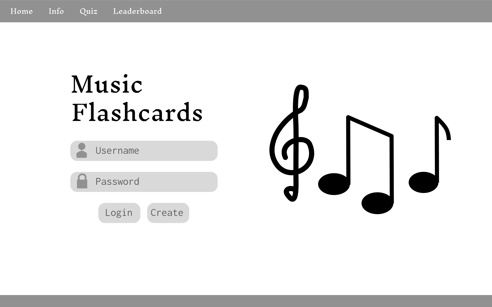
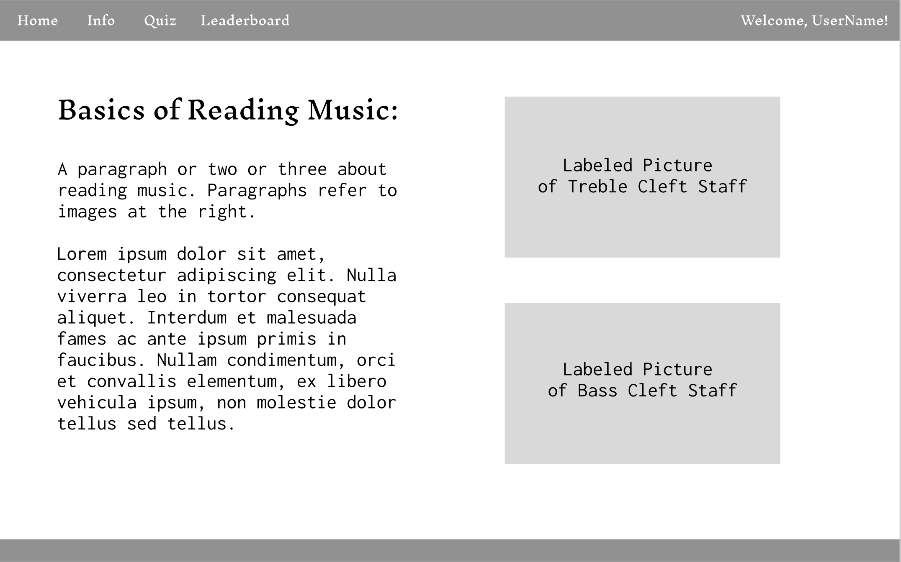
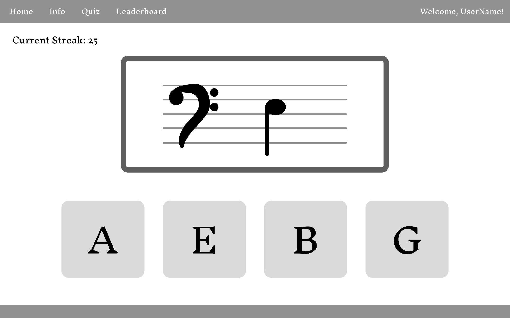
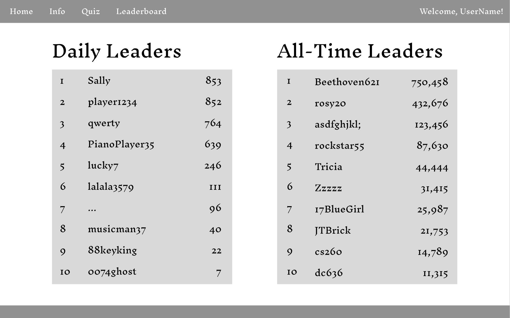

# Music Flashcards

## Specification Deliverable:

### Elevator Pitch

Do you play a musical instrument? Have you ever wanted to learn? A key component to a successful musician is the ability to read notes from sheet music. Learning to recognize notes on sight is a process that takes time and practice. The Music Flashcards application provides a simple way for users to learn and practice sight reading notes from a musical staff. Users can motivate themselves and their friends to practice as they compete for a spot on the leaderboards. As users use the application, they will grow in their confidence and ability to read sheet music and improve in their musicianship. 

### Design

Here is the layout of the login page (home page).

This is the layout of the information page (a basic overview of reading sheet music).

The quiz page (interactive/game page) will look something similar to this.

Here is the basic layout of the leaderboard page.

### Key Features

- Quiz mode: Users will be presented with an image of a note on a sheet music staff. They will have four letter-name options to attempt to select the correct answer from. For each correct answer in a row, a user's "streak" will increase. Once a player selects an incorrect answer, their streak will reset.
- Leaderboard: Two leaderboard displays will be shown on the leaderboard page—a daily leaderboard and an all-time leaderboard. Scores are determined by the number of correct matches a user completes in quiz mode in a row (a.k.a. a "streak"). The top 10 all-time high scores and the top 10 daily scores is stored in the database. The daily scores are reset every night at midnight.
- Information: A page with basic information on reading a music staff will be available to help users to learn.
- Login: Secure login over HTTPS. 

### Technologies

I will use these technologies in the following ways:

- **HTML**: Correctly use HTML to structure the application. Four HTML pages (home/login, information, quiz, leaderboard).
- **CSS**: Ensure the application looks good on various screen sizes. Apply appropriate styling (color, font, whitespace, etc.).
- **JavaScript**: Keeps track of score. Randomize and display answer choices and ensure that the correct answer is always among the options. Record users' input and determine if answer is correct. Backend endpoint calls.
- **Web service**: Saves scores in database. Retrieves correct answers. Endpoints for login, saving scores, determining correct answers, and submitting answers. Third party service to pull random images to appear on leaderboard page.
- **Authentication**: Securely register and login users. Authentication is required to play the game.
- **Database persistence**: Store login credentials securely in a database. Store user's total (lifetime) and daily number of correct matches.
- **WebSocket**: Broadcast username to other users when they begin a quiz session, e.g. "UserName started practicing with flashcards!"
- **Web framework**: Use React to create components and request routing.

## HTML Deliverable
For this deliverable, I built the structure of my application with HTML.

- HTML Pages: (COMPLETED) Four HTML pages that represent a home/login page, a quiz page, a leaderboard page, and an information (how to) page.
- Use of HTML Tags: (COMPLETED) I used BODY, NAV, MAIN, HEADER, and FOOTER tags in my design.
- Links: (COMPLETED) The navigation bar in the header links each page to the others. Also, when a user logs in, they are automatically sent to the quiz page.
- Textual Content: (COMPLETED) I have added labels for login information, a brief introduction to reading music on the information page, and other content, such as the "streak" counter on the quiz page, throughout the application.
- 3rd Party Service Calls: (COMPLETED) Represented by an image on the leaderboard page (eventually, the service will be called to get a random image for the page).
- Images: (COMPLETED) Images are found on each page (sheet music on home page, labeled staffs on information page, random third party image on leaderboard page, and note image on quiz page).
- Login: (COMPLETED) There are placeholders for the username and password input, as well as buttons to log in or create an account. On each page, the user's name is displayed with "Welcome, Username!"
- Database: (COMPLETED) I have placeholder scores on the leaderboards, eventually, these will be actual scores that come from the database.
- WebSocket: (COMPLETED) On the quiz page, I have inserted placeholder values for data that will be displayed in real-time with WebSocket (i.e. "User52 just started practicing with flashcards!").

## CSS Deliverable
For this deliverable, I styled my application with CSS.

- Prerequisite: (COMPLETED) Simon CSS deployed to your production environment.
- Prerequisite: (COMPLETED) A link to your GitHub startup repository prominently displayed on your application's home page.
- Prerequisite: (COMPLETED) Notes in your startup Git repository README.md file documenting what you modified and added with this deliverable. The TAs will only grade things that have been clearly described as being completed. Review the voter app as an example.
- Prerequisite: (COMPLETED) At least 10 git commits spread consistently throughout the assignment period.

- Header, Footer, and Main Content Body: (COMPLETED) I used Bootstrap to style my header (navigation), footer (name and GitHub link), and main content (different for each page) elements of the body element. 
- Navigation Elements: (COMPLETED) The text on my navigation changes color with hover. Also, an oval around the navigation element denotes the active page. 
- Responsive to Window Resizing: (COMPLETED) The site looks good on devices of various dimensions. 
- Application Elements: (COMPLETED) Buttons, images, tables, text, and other elements are styled using Bootstrap. I altered Bootstrap's color scheme for the buttons. Elements are responsive to window resizing.
- Application Text Content: (COMPLETED) Text is displayed from the following font family: 'Trebuchet MS', 'Lucida Sans Unicode', 'Lucida Grande', 'Lucida Sans', Arial, sans-serif. The text's color is either a very dark blue or a very light blue, depending its contrast with the surrounding elements.
- Application Images: (COMPLETED) The home page is displayed with a background image. The placeholder image for the 3rd party service calls located on the leaderboard page has been styled and is ready to hold images. I resized the images for the information and quiz pages, as well.

## JavaScript Deliverable
For this deliverable, I implemented the logic of my application so that it works for a single user. I also implemented placeholders for future application features (i.e. WebSocket).

Prerequisites:
- Prerequisite: (COMPLETED) Simon JavaScript deployed to your production environment
- Prerequisite: (COMPLETED) A link to your GitHub startup repository prominently displayed on your application's home page
- Prerequisite: (COMPLETED) Notes in your startup Git repository README.md file documenting what you modified and added with this deliverable. The TAs will only grade things that have been clearly described as being completed. Review the voter app as an example.
- Prerequisite: (COMPLETED) At least 10 git commits spread consistently throughout the assignment period.

JavaScript Implementation:
- Support for Future Login: (COMPLETED) Users can enter a username and "login". On login, users are redirected to the quiz page. Also, the user's username is displayed in a "Welcome" message in the top right corner of the application. Without being logged in, a user cannot play the quiz.
- Support for Future Database Data: (COMPLETED) When a user scores within the daily or all-time top 10, their score is recorded in the local storage (in the future, the score will be recorded in the database). Scores on the leaderboards are loaded from the local storage. 
- Support for Future WebSocket: (COMPLETED) I used an interval to periodically display a new message on the quiz page. These represent real-time messages sent via WebSocket in the future. 
- Support for Application's Interaction Logic: (COMPLETED) I built the quiz logic, including populating the buttons (ensuring that no more than one of each possible button is displayed at a time and that the correct answer is among the options), checking a user's answer, incrementing or resetting a user's "streak" (depending on if they got the question right or not), and inserting high scores into the leaderboard. Also, the daily leaderboard resets every night at midnight. 

## Service Deliverable
For this deliverable, I added backend endpoints that update and retrieve leaderboard scores.

Prerequisites:
- Prerequisite: (COMPLETED) Simon Service deployed to your production environment
- Prerequisite: (COMPLETED) A link to your GitHub startup repository prominently displayed on your application's home page
- Prerequisite: (COMPLETED) Notes in your startup Git repository README.md file documenting what you modified and added with this deliverable. The TAs will only grade things that have been clearly described as being completed. Review the voter app as an example.
- Prerequisite: (COMPLETED) At least 10 git commits spread consistently throughout the assignment period.

Service Implementation:
- HTTP Service Using Node.js and Express: Done! 
- Express Static Middleware to Serve Up Frontend: Done! 
- Third-Party Service Endpoints: Done! I used Lorem Picsum's api to retrieve a random image to display on the scores page using a fetch method.
- Backend Service Endpoints: Done! I have an endpoint to update (post) the scoreboard each time someone gets an answer wrong or navigates away from the quiz page. I also have an endpoint to retrieve (get) scores from the server when a user navigates to the scores page.
- Frontend Calls Service Endpoints: Done! I used a fetch method in the frontend quiz.js updateScores() method to call my score posting endpoint in the backend, and I used a fetch method in the frontend scores.js loadDailyScoreboard() and loadAllTimeScoreboard() functions to call my score retrieval endpoint in the backend. 

## Login Deliverable
For this deliverable, I implemented application authorization and authentication.

Prerequisites:
- Prerequisite: (COMPLETED) Simon Login deployed to your production environment with your dbConfig.json credentials
- Prerequisite: (COMPLETED) A link to your GitHub startup repository prominently displayed on your application's home page
- Prerequisite: (COMPLETED) Notes in your startup Git repository README.md file documenting what you modified and added with this deliverable. The TAs will only grade things that have been clearly described as being completed. Review the voter app as an example.
- Prerequisite: (COMPLETED) At least 10 git commits spread consistently throughout the assignment period.

Login Implementation:
- New User Registration: Users can sign up for an account with a username and password; their credentials are stored in the MongoDB database.
- Existing User Authentication: Users sign in with the username and password used to create their account.
- Application Data Stored in MongoDB: Both daily and all time leaderboards are stored in the database. Daily leaderboard is reset (all elements deleted) every night at midnight. The "current midnight" is also stored in the database.
- Storage and Retrieval of Credentials in MongoDB: User information is stored in the database. Passwords are encrypted using bcrypt. For authentication, user information is pulled from the database and compared to user inputs.
- Application Restrictions Based on Authentication: Only authenticated users can see the navigation menu bar. Additionally, only authenticated users can see scores on the scores page and play the quiz on the quiz page. 
